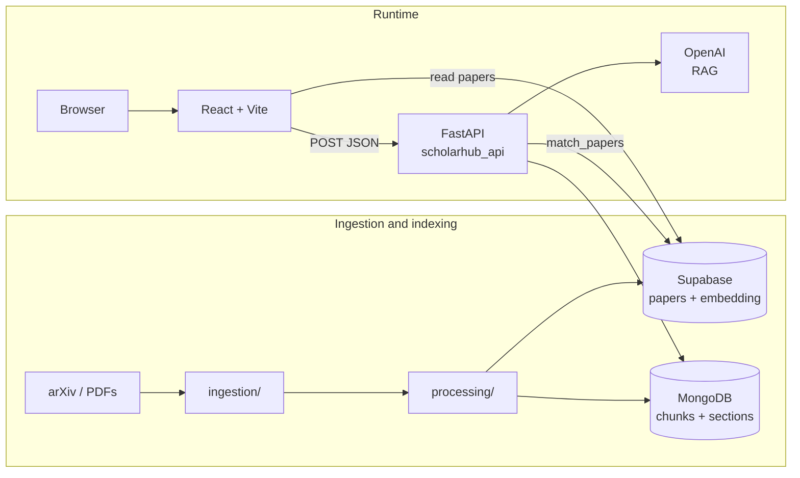
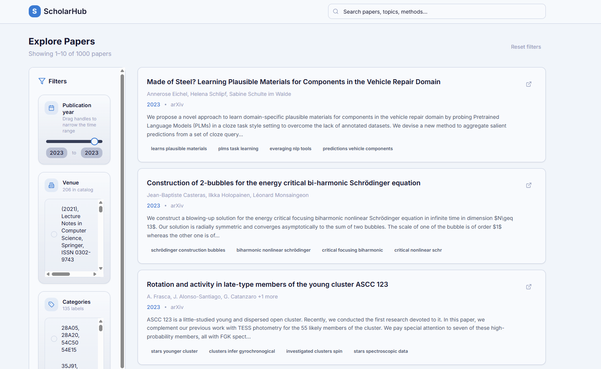
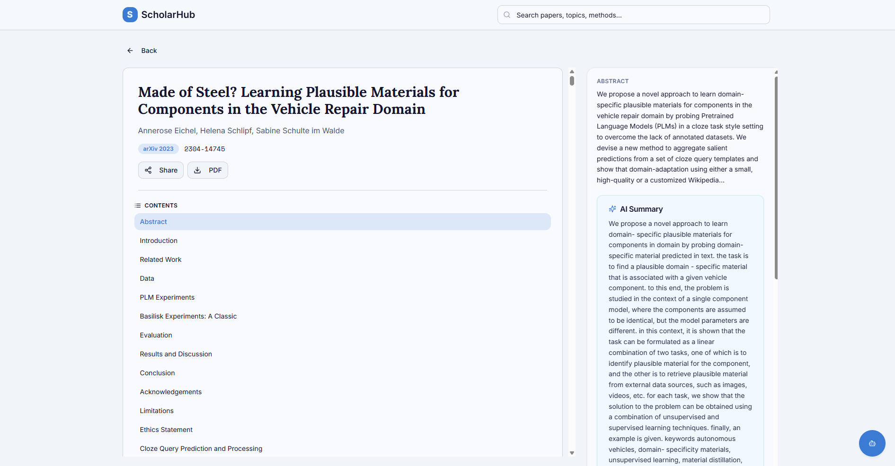
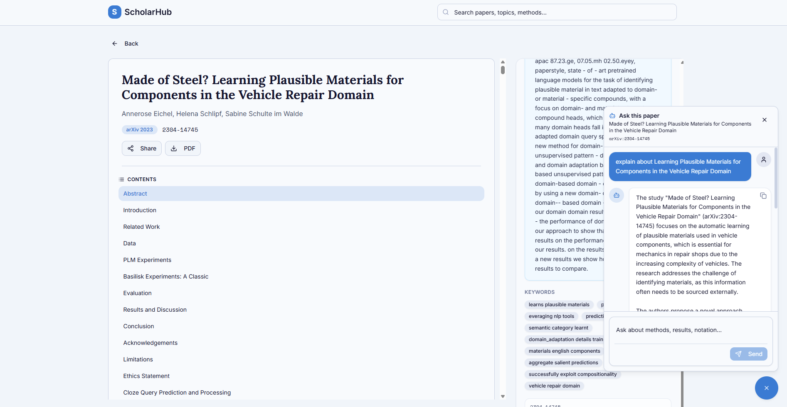

# ScholarHub

**ScholarHub** is a research companion for exploring academic papers: semantic search over an embedded catalog, rich paper detail (including full-text excerpts when ingested), and **RAG chat** grounded in paper content. The stack pairs a **React (Vite)** frontend with a **FastAPI** service for embeddings, vector search, Mongo-backed documents, and optional OpenAI chat.


## Pipeline overview

Offline jobs pull or import papers, compute **embeddings** and **structured chunks**, then write to **Supabase** (paper metadata + `pgvector`) and optionally **MongoDB** (full text for the viewer and RAG). At runtime the SPA reads the catalog from Supabase and calls the API for semantic ranking, `/document/{id}`, and `/chat/rag`.



## Features

- **Explore**: filter papers by year, venue, and categories; **semantic search** re-ranks results when the API and embeddings are available (falls back to keyword order).



- **Paper viewer**: abstract, keywords, AI summary when present; **full-text sections** when `mongo_doc_id` is linked and MongoDB is configured on the API.



- **Paper RAG chat**: ask questions in context of the current paper (requires OpenAI on the API and sufficient excerpt data).



## Tech stack

| Layer | Technologies |
|--------|----------------|
| Frontend | React 18, TypeScript, Vite, Tailwind CSS, shadcn/ui, TanStack Query, KaTeX |
| API | FastAPI, Uvicorn, sentence-transformers (BGE), Supabase Python client, PyMongo, OpenAI SDK |
| Data | Supabase (Postgres + pgvector), optional MongoDB for document bodies |
| Tooling | ESLint, processing/ and ingestion/ Python pipelines |

## Repository layout

```
ScholarHub/
├── src/                    # React SPA (pages, components, hooks, lib)
├── server/
│   └── scholarhub_api.py   # FastAPI app: /health, /search/semantic, /document, /chat/rag
├── processing/             # Embeddings, summarization, DB orchestration helpers
├── ingestion/              # arXiv crawl, import to Supabase, schedulers
├── scripts/
│   └── static-serve.mjs    # Production static server (PORT)
├── images/
│   └── pipeline.svg        # Architecture / pipeline diagram
├── Dockerfile              # Multi-stage image: build Vite, serve dist/
├── Dockerfile.api          # Python API (GPU-free CPU; preloads embedding model)
├── package.json
├── requirements.txt
└── README.md
```

## Prerequisites

- **Node.js** 20+ (22 recommended for Docker parity)
- **Python** 3.11+
- **Supabase** project with papers schema, embeddings on `papers`, and an RPC such as `match_papers` used by the API
- Optional: **MongoDB** for full-text and RAG excerpts; **OpenAI** API key for chat

## Local development

### 1. Environment

Copy and edit a root `.env` (see tables below). The API loads it via `python-dotenv`; Vite reads `VITE_*` at dev time.

### 2. Install and run frontend

```bash
npm install
npm run dev
```

Default Vite dev server: `http://localhost:5173`

### 3. Install and run API

```bash
python -m venv .venv
# Windows: .venv\Scripts\activate
# macOS/Linux: source .venv/bin/activate
pip install -r requirements.txt
npm run api
```

This runs `uvicorn server.scholarhub_api:app` on `127.0.0.1:3001`. Point the SPA at it:

```bash
# .env.local or .env
VITE_SCHOLARHUB_API_URL=http://127.0.0.1:3001
```

### 4. Production build (local)

```bash
npm run build
npm start
```

Serves `dist/` on `PORT` (default from `static-serve.mjs`).

## Environment variables

### Frontend (build-time `VITE_*`)

| Variable | Description |
|----------|-------------|
| `VITE_SUPABASE_URL` | Supabase project URL |
| `VITE_SUPABASE_ANON_KEY` | Supabase anonymous (public) key |
| `VITE_SCHOLARHUB_API_URL` | Public base URL of the FastAPI service, e.g. `https://api.example.com` (no trailing slash). **Must include `https://` in production.** |
| `VITE_RAG_API_URL` | Optional fallback if `VITE_SCHOLARHUB_API_URL` is unset |

### API (server)

| Variable | Description |
|----------|-------------|
| `SUPABASE_URL` | Same project URL as above |
| `SUPABASE_KEY` | **Service role** key (server only; never expose to the browser) |
| `MONGO_URL` | Optional MongoDB connection string |
| `DATABASE_NAME` | MongoDB database name (required if using Mongo) |
| `DOCUMENT_CONTENTS_COLLECTION` | Optional; default `document_contents` |
| `OPENAI_API_KEY` | Required for `/chat/rag` |
| `OPENAI_CHAT_MODEL` | Optional; default `gpt-4o-mini` |
| `PORT` | Listen port (e.g. Railway sets this automatically) |

## HTTP API (FastAPI)

| Method | Path | Purpose |
|--------|------|---------|
| `GET` | `/health` | Liveness check |
| `POST` | `/search/semantic` | Body: `{ "query", "limit" }` — embed query, rank via Supabase vector search |
| `GET` | `/document/{doc_id}` | MongoDB document by24-hex ObjectId (503 if Mongo not configured) |
| `POST` | `/chat/rag` | RAG chat with paper context |

There is **no** route on `/`; a 404 there is expected.

## Docker

- **Frontend image** (root `Dockerfile`): pass build args `VITE_SUPABASE_URL`, `VITE_SUPABASE_ANON_KEY`, `VITE_SCHOLARHUB_API_URL` (and optional `VITE_RAG_API_URL`).
- **API image** (`Dockerfile.api`): set Supabase, optional Mongo, optional OpenAI; first boot downloads the embedding model (allow a long health-check start period).

Example:

```bash
docker build -f Dockerfile.api -t scholarhub-api .
docker build -f Dockerfile \
  --build-arg VITE_SUPABASE_URL=... \
  --build-arg VITE_SUPABASE_ANON_KEY=... \
  --build-arg VITE_SCHOLARHUB_API_URL=https://your-api-host \
  -t scholarhub-web .
```